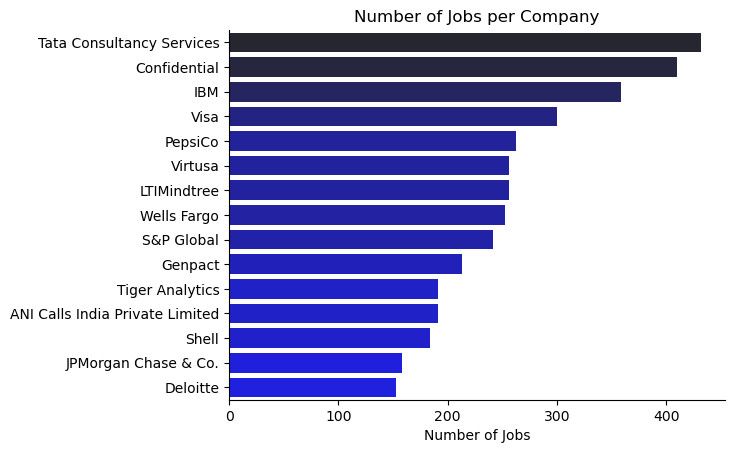
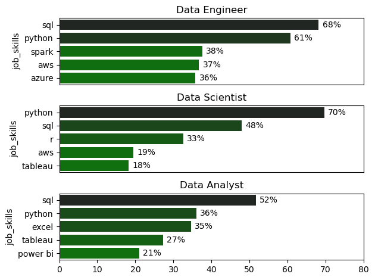
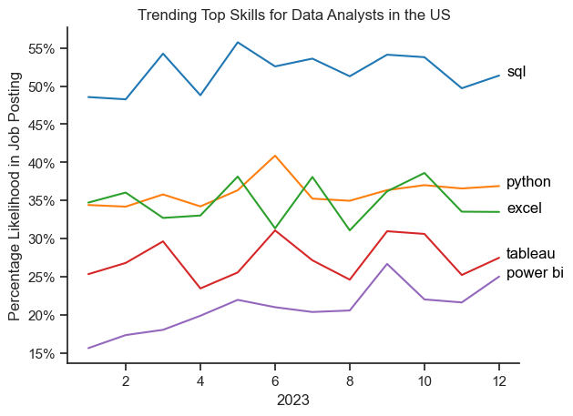

# Data Analyst Market Insights with Python 

An advanced, end-to-end exploratory data analysis (EDA) of the global and Indian data science job markets. This project utilizes real-world job posting data from the `lukebarousse/data_jobs` dataset to uncover geographical hiring distributions, in-demand technical skills, specialized salary spreads, and optimal high-ROI skill sets.

---

## Core Tech Stack & Frameworks

- **Data Wrangling:** Pandas & NumPy
- **Visual Analytics:** Seaborn & Matplotlib
- **Advanced Text Placement:** `adjustText` (for non-overlapping label mechanics in scatter plots)
- **Dataset Hosting:** Hugging Face `datasets`
- **Development Environment:** Jupyter Notebooks

---

##  Technical Pipeline & Data Preprocessing

Before proceeding with targeted visual analyses, a robust data extraction and cleaning pipeline is applied across all notebooks:

1. **Dataset Ingestion:** Direct retrieval from the Hugging Face Hub using the `datasets` module to generate a Pandas DataFrame.
2. **Temporal Parsing:** Extraction and conversion of string date fields (`job_posted_date`) into datetime formats using `pd.to_datetime()`.
3. **Complex Column Standardization:** Using Abstract Syntax Tree parsing (`ast.literal_eval`) to safely evaluate and parse serialized string data within nested skill array columns (`job_skills`) without risking manual string manipulation bugs.
4. **Targeted Subsetting:** Filtering specific cross-sections of the dataset based on geography (`job_country == 'India'`) and availability of annual salary data (`.dropna(subset=['salary_year_avg'])`).

---

##  Project Architecture & Deep-Dive Notebook Breakdown

### 1. [Exploring Data Job Markets](Projects_Dataanalysis/1.ExploringthroughData.ipynb)
**Objective:** Map out macro-level hiring trends, prominent job hubs globally, and foundational perks offered across the tech industry.

####  Technical Workflow & Analysis:
- Aggregated over tens of thousands of postings using Pandas `.value_counts()` grouped by `job_title_short`, `job_country`, and `company_name`.
- Extracted localized hiring parameters specifically for companies based in India.
- Generated dynamic pie chart subplots (`plt.subplots(1, 3)`) to parse key binary employment factors.

####  Key Analytics & Findings:
- Identified top countries offering the highest concentration of data-related job openings.
- Established baseline workplace expectations by breaking down percentages for:
  - **Work From Home (WFH) Availability**
  - **Degree Requirements** (Mentions vs. No Mentions)
  - **Health Insurance Offerings**

####  Visual Output:

---

### 2. [In-Demand Skills for Top Roles](Projects_Dataanalysis/2_Demandingskills.ipynb)
**Objective:** Uncover the exact technical tools most frequently requested by recruiters for major data positions in the Indian tech market.

####  Technical Workflow & Analysis:
- Filtered the dataset explicitly for Indian job postings and extracted the top 3 job titles by overall volume.
- Exploded the listed nested arrays in `job_skills` to extract individual technologies per posting.
- Combined the data via targeted group-bys (`.groupby(['job_title_short', 'job_skills']).size()`) to count skill occurrences.
- Created multi-faceted, vertical Seaborn bar chart subplots (`sns.barplot`) to display the exact percentage likelihood of each skill appearing in a role's description.

####  Key Analytics & Findings:
- Compared the top 5 most highly demanded skills side-by-side across **Data Analysts**, **Data Engineers**, and **Data Scientists** in India.
- Allowed for targeted, role-specific learning paths based on exact market saturation metrics.

####  Visual Output:

---

### 3. [Skill Trends Month-by-Month](Projects_Dataanalysis/3_SKill_Trends.ipynb)
**Objective:** Track temporal shifts in skill requirements for data roles to map out long-term and seasonal tool demand.

####  Technical Workflow & Analysis:
- Extracted posting months using temporal attributes (`.dt.month_no`) and combined them with the exploded skill categories.
- Calculated continuous rolling proportions to measure month-by-month changes in skill frequency over a 12-month timeline.
- Designed highly readable time-series plots (`sns.lineplot`) using the `tab10` palette.
- Formatted the Y-axis using Matplotlib's `FuncFormatter` to convert raw proportions directly into clear percentage strings.

####  Key Analytics & Findings:
- Identified consistent core tools (e.g., Python, SQL) versus seasonal technologies.
- Enabled data professionals to accurately predict shifts in skill trends across different quarters of the year.

####  Visual Output:

---

### 4. [Salary Distributions by Job Role](/Projects_Dataanalysis/4.jobroles_SalaryAnalysis.ipynb)
**Objective:** Evaluate salary distributions and median compensation benchmarks for data roles in India.

####  Technical Workflow & Analysis:
- Filtered out job listings lacking annual salary figures (`.dropna(subset=['salary_year_avg'])`).
- Sorted the top 6 job titles by descending median compensation package.
- Leveraged customized Seaborn box plots (`sns.boxplot`) to reveal important descriptive metrics:
  - Median annual compensation levels.
  - Overall spread and interquartile ranges (IQR).
  - High and low compensation outliers.

####  Key Analytics & Findings:
- Uncovered high-paying specialties within the Indian data field.
- Highlighted the baseline salary progression steps when leveling up from entry-level positions to specialized engineering roles.

####  Visual Output:

---

### 5. [Optimal Skills to Learn](Projects_Dataanalysis/5.best_Skills.ipynb)
**Objective:** Map out high-demand vs. high-paying technologies to identify high-ROI skills.

####  Technical Workflow & Analysis:
- Conducted multi-variable Pandas aggregations combining the median salary of a skill with its total posting count (`.agg(['count', 'median'])`).
- Plotted the results onto a scatter plot (`plt.scatter`), setting the X-axis to represent job count and the Y-axis to represent median salary.
- Applied the `adjustText` package to automatically format and nudge label text away from data points, preventing any visual overlap.

####  Key Analytics & Findings:
- Categorized technologies into four distinct quadrants:
  - **High Demand, High Pay:** Immediate priority technologies for career advancement.
  - **High Demand, Low Pay:** Standard industry baseline skills.
  - **Low Demand, High Pay:** Niche/specialized engineering tools.
  - **Low Demand, Low Pay:** Outdated or less critical software.
- Pinpointed the most optimal skills to learn to maximize salary without sacrificing job volume.

####  Visual Output:
.png)

---

